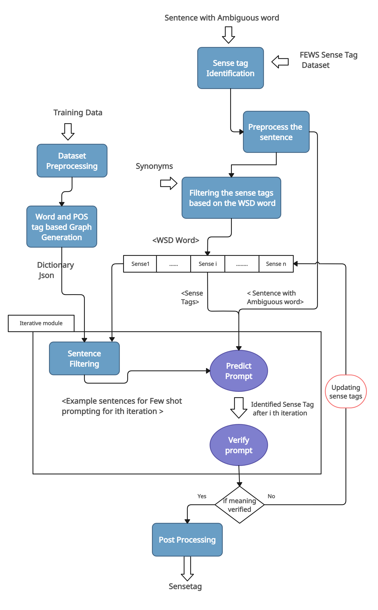
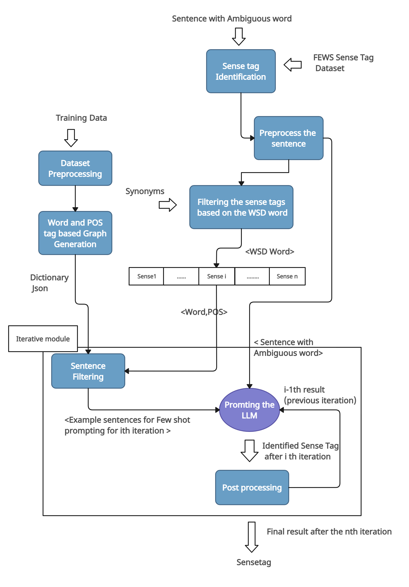

# GLOSSGPT Few-Shot Prompt-Based Word Sense Disambiguation

## Table of Contents

- [Introduction](#introduction)  
- [Features](#features)  
- [Installation](#installation)  


---

## Introduction

Lexical ambiguity poses significant challenges in natural language processing (NLP) tasks such as translation and question answering. This repository implements a **few-shot Chain of Thought (COT) prompting technique** with **GPT-4-Turbo** for **Word Sense Disambiguation (WSD)**. The approach eliminates the need for model fine-tuning by employing advanced prompts and integrating knowledgebases for context enrichment. This technique has achieved state-of-the-art performance, surpassing 90% F1 on the **FEWS dataset**.

---

## Features

- **Prompt-Driven WSD**: No fine-tuning required, enabling rapid deployment for specific tasks.  
- **Knowledgebase Support**: External retrievers enhance sense prediction with synonyms and context.  
- **High Performance**: Sets a new benchmark on FEWS, with competitive results on SemEval and Senseval datasets.  

---

## Installation

1. **Clone the repository**:  
   ```bash
   git clone https://github.com/<your-repo-name>/lexical-ambiguity-resolver.git
   cd lexical-ambiguity-resolver

2. **Install dependencies**
  ```bash
   pip install -r requirements.txt
```

3. Preparing the Environment
   Obtain access to GPT-4-Turbo through OpenAI.
```bash
OPENAI_API_KEY="your_openai_api_key"
```

## Proposed Pipelines

1. Fewshot COT prompting


2. Predict and Verify Approach

   
3. Iterative Binary Classification


4. Proposed Knowledge base Structure
   
  


